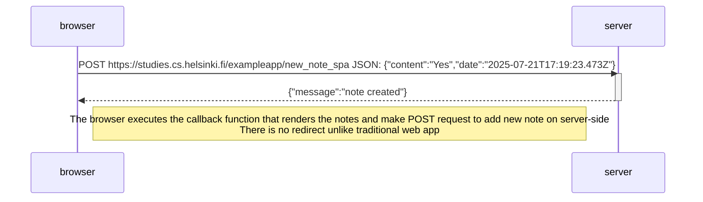

```mermaid
sequenceDiagram
    participant browser
    participant server

    browser->>server: POST https://studies.cs.helsinki.fi/exampleapp/new_note_spa JSON: {"content":"Yes","date":"2025-07-21T17:19:23.473Z"}
    activate server
    server-->>browser: {"message":"note created"}
    deactivate server

    Note right of browser: The browser executes the callback function that renders the notes and make POST request to add new note on server-side<br>There is no redirect unlike traditional web app
```